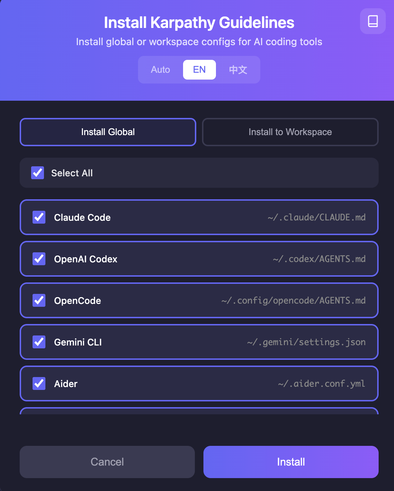

# Karpathy Guidelines VS Code Extension

Apply Andrej Karpathy's behavioral guidelines across the main AI coding CLIs and IDEs from a single VS Code extension.

<p align="center">
  
</p>

## What changed

This extension now uses a shared `AGENTS.md` source of truth when possible, then generates tool-specific entrypoints only for tools that need them.

That makes it practical to keep Claude Code, Codex, OpenCode, Gemini CLI, Cursor, Windsurf, GitHub Copilot, Cline, Continue, and Aider aligned instead of hand-maintaining separate instruction files.

## Commands

| Command | Description |
|---------|-------------|
| `Karpathy: Show Rules` | Open the full guidelines in a new tab |
| `Karpathy: Quick Reference` | Open a compact quick-reference panel |
| `Karpathy: Insert into Current File` | Insert the guidelines into the active editor |
| `Karpathy: Create Configs for Selected Tools` | Pick one or more targets and generate matching config files |
| `Karpathy: Create Detected Tool Configs` | Detect tools from the current workspace and generate compatible files |
| `Karpathy: Create All Supported Configs` | Generate every supported target config |
| `Karpathy: List Supported Tools` | Show supported tools, output paths, and notes |
| `Karpathy: Check Workspace Configs` | Inspect which workspace configs already exist |
| `Karpathy: Install Global Configs` | Open the install dialog in global mode |
| `Karpathy: Install Workspace Configs` | Open the install dialog in workspace mode |
| `Karpathy: Install Local Configs` | Alias for workspace install |
| `Karpathy: Install All Global Configs` | Open the install dialog with all global targets selected |
| `Karpathy: Open Settings` | Open the install and configuration dialog |

## Supported targets

| Tool | Type | Generated files |
|------|------|-----------------|
| Claude Code | CLI | `AGENTS.md`, `CLAUDE.md` |
| OpenAI Codex | CLI | `AGENTS.md` |
| OpenCode | CLI | `AGENTS.md` |
| Gemini CLI | CLI | `AGENTS.md`, `GEMINI.md`, `.gemini/settings.json` |
| Aider | CLI | `AGENTS.md`, `.aider.conf.yml` |
| Cursor | IDE | `AGENTS.md`, `.cursor/rules/karpathy-guidelines.mdc` |
| Windsurf | IDE | `AGENTS.md`, `.windsurf/rules/karpathy-guidelines.md` |
| GitHub Copilot / Copilot CLI | IDE / CLI | `AGENTS.md`, `.github/copilot-instructions.md`, `.github/instructions/karpathy-guidelines.instructions.md` |
| Cline | VS Code extension | `AGENTS.md`, `.clinerules/karpathy-guidelines.md` |
| Continue | VS Code extension | `AGENTS.md`, `.continue/rules/karpathy-guidelines.md` |

## Installation

### Development

```bash
cd vscode-extension
npm install
npm run compile
code --extensionDevelopmentPath=$(pwd)
```

### Package

```bash
cd vscode-extension
npm install
npm run package
code --install-extension karpathy-guidelines-1.1.2.vsix
```

## Configuration

| Setting | Default | Description |
|---------|---------|-------------|
| `karpathyGuidelines.insertAs` | `markdown` | Insert format: `markdown`, `comments`, or `plaintext` |
| `karpathyGuidelines.autoActivate` | `false` | Automatically open quick reference when a Markdown file is opened |
| `karpathyGuidelines.defaultTool` | `cursor` | Default preselected target in the multi-tool picker |
| `karpathyGuidelines.overwriteExisting` | `true` | Overwrite existing config files during generation |
| `karpathyGuidelines.language` | `auto` | Language for generated configs and dialogs |

## Design approach

1. `AGENTS.md` is the canonical repository rule file whenever the target supports it.
2. Tool-specific files stay thin and mostly point back to the shared rules.
3. Generation is adapter-driven, so adding another mainstream target means adding one registry entry instead of editing command logic.

## License

MIT
